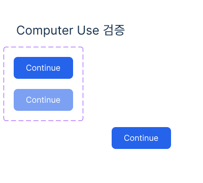

# Figma Computer Use 기능 검증 — 2026-09-07

네이티브 Figma의 주요 작업 흐름은 실제 실행으로 확인했다. 브라우저 편집과 클라우드/이름 있는 버전 저장은 확인하지 못했으므로 전체 무조건 통과로 판정하지 않는다. 문서에 소개된 모든 고급 기능·조합·플랫폼을 시험한 결과도 아니다.

## 환경과 범위

- 사용자 요청: `전체 기능 검증 해주세요`.
- 대상: `figma-computer-use`, 수정 후 Skill/Plugin 버전 `0.1.1`.
- 환경: macOS, Figma desktop `126.8.18`, 한국어 UI, `mcp__cua_repl.js`.
- 전용 초안: [Figma Computer Use QA · 2026-09-07](https://www.figma.com/design/4Y6z00UTrRvawv6mLz6nJd/Figma-Computer-Use-QA-%C2%B7-2026-09-07?node-id=1-2).
- 테스트는 이 새 초안에서 수행했다. Figma 조작은 computer-use의 AX·스크린샷·UI 입력만 사용했다. Figma MCP/REST/Plugin API, 직접 CDP, 숨겨진 문서 상태, shell UI 자동화는 사용하지 않았다.
- shell은 패키지 유지보수와 내보낸 파일 검증에 사용했다. 기존의 무관한 Git 변경은 보존했다. 커밋·푸시·Plugin 설치·앱 업데이트는 수행하지 않았다.

## 실행 결과

| 기능 | 결과 | 확인한 증거와 범위 |
| --- | --- | --- |
| 네이티브 연결·검사 | 통과 | `com.figma.Desktop` 연결, 파일·페이지·선택 레이어의 AX 및 화면 확인 |
| 파일·페이지 | 통과 | 새 초안 생성/이름 변경, Page 1과 QA Imports 생성 및 전환 |
| 프레임 | 통과 | QA / Start와 QA / Done, 각 400×360, 복제 후 이름/제목 변경 |
| 한글 텍스트 | 통과 | `Computer Use 검증`을 네이티브 텍스트로 입력하고 24 크기·17324D 색상 및 렌더링 확인 |
| 텍스트 스타일 | 통과 | 로컬 QA/Heading, 24/Auto 생성 및 적용 |
| Auto layout | 부분 통과 | 가로 Hug 버튼 117×43, 좌우/상하 padding 24/12, gap 10, radius 8. 외부 프레임 Fixed 400×360. Fill·반응형 reflow·grid는 미실행 |
| 컴포넌트/variants | 통과 | QA Button 컴포넌트 set 생성, State=Primary/Secondary, opacity 100%/60% 확인 |
| 인스턴스 | 통과 | Assets에서 삽입, Secondary↔Primary 전환, 스타일/변수 연결 유지, cut/paste로 Start 내부 재배치 및 X=220/Y=250 확인 |
| 기타 컴포넌트 속성 | 미실행 | text/boolean/instance swap/slot 속성 생성·변경은 별도 검증 필요 |
| 변수 | 부분 통과 | QA/Primary 색상 변수 2563EB 생성 및 fill 연결 확인. modes/aliases/opacity-variable 바인딩은 미실행 |
| 프로토타입 설정 | 통과 | Flow 1, Start 인스턴스 On click → Navigate to QA / Done, Done 인스턴스 On click → Back |
| 프로토타입 실행 | 통과 | 프레젠테이션에서 실제 하단 Continue 버튼 클릭 → `QA Complete` 및 node-id=1-20, 다시 버튼 클릭 → `Computer Use 검증` 및 node-id=1-2. 프레젠테이션 다음 프레임 컨트롤을 통한 이동으로 대신하지 않음 |
| PNG export | 통과 | Start 프레임 PNG 1x, 네이티브 폴더 선택창으로 저장. 실제 PNG 400×360 및 한글/버튼 렌더링 확인 |
| PNG import | 통과 | 같은 PNG를 File → 이미지/동영상 배치로 열어 QA Imports에 400×360 `Start 1` 직사각형으로 배치. 원본 편집 가능 레이어는 Page 1에 유지 |
| 기타 export | 미실행 | SVG/JPG/PDF/로컬 .fig 복사본은 미실행 |
| 저장 | 미확인 | 버전 내역에서 오후 10:56 항목 확인. `Computer-use QA 2026-09-07` 제목의 버전 추가/저장 시도 후 목록에 해당 제목이 나타나지 않음. 오류 대화상자는 없었지만 완료로 판정하지 않음. 클라우드 재열기·독립 세션 확인도 미실행 |
| timeout 복구 | 통과한 사례 있음 | 한글 paste timeout 후 실제 삽입 확인, 중복 삽입 방지. 네이티브 연결 중단 뒤 도구 kernel reset 후 같은 앱/파일 재연결 및 후속 export/import 수행 |
| 브라우저 경로 | 차단 | IAB 로그인 세션 만료, Chrome 연결 timeout으로 편집까지 도달하지 못함 |
| 설치/신규 세션 노출 | 미실행 | 소스 및 배포 구조 검사와 구분. 설치가 요청되지 않아 수행하지 않음 |

## 실제 산출물

[Start.png](figma-computer-use-evidence/2026-09-07/QA/Start.png)는 Figma UI로 내보낸 원본 PNG다. `sips`로 400×360을 확인하고 `view_image`로 렌더링을 검사했다. 프레임 이름 `QA / Start`의 `/`가 export 하위 폴더 `QA/Start.png`에 반영되었다.



왼쪽 위의 두 버튼은 variants 확인용 메인 컴포넌트 예시이며, 하단 버튼이 프로토타입 이동용 인스턴스다. 이 화면은 기능 검증 fixture이며 제품 UI 납품물이 아니다. 편집기/프로토타입/import 화면도 computer-use 스크린샷으로 관측했으나, 파일 경로가 반환되지 않은 화면을 저장된 이미지 파일로 주장하지 않는다.

## 발견한 문제와 반영

| 관측 | 대응 및 결과 |
| --- | --- |
| 포커스 없는 `setValue`에서 font-size AX가 24로 보였으나 재선택 시 12로 돌아옴 | 필드를 클릭해 포커스 → 값 입력 → Return → 객체 재선택/기하 확인으로 24 적용. 스킬 예제와 완료 기준 수정 |
| X/Y AX spinbutton setter가 실제 값을 바꾸지 않음 | 현재 스크린샷에서 숫자를 선택해 입력/커밋 후 readback. 동일 setter 반복 대신 노출된 대체 UI 사용을 명시 |
| HEX numeric spinner에서 `invalidNumber("2563EB")` | 색상 text/combobox 경로 사용. 색상값을 임의로 숫자로 바꾸지 않도록 안내 |
| `Computer Use server error -10005: Timed out waiting for the application to read the clipboard` | 오류 뒤 실제 한글 삽입을 확인했고 다시 붙이지 않음. 실패 응답과 작업 결과를 별도로 검사하도록 보강 |
| 프레임 drag가 1×1 생성 | 기존 프레임의 W/H를 정확한 필드로 수정해 400×360 확인. 생성 반복 방지 |
| 페이지/선택 변경 직후 AX가 이전 상태를 보여줌 | 새 관측으로 완료 상태를 확인한 뒤 다음 변경. 지연 중 같은 클릭을 무작정 반복하지 않음 |
| `Sky Computer Use native pipe closed before response` | 네이티브 재연결 시도와 지원 browser fallback 수행 |
| `Computer Use server error -10005: codex app-server exited before returning a response` | 연결 오류로 기록. Figma 자체를 재시작하지 않음 |
| IAB `로그아웃되었습니다`, 세션 만료 UI | 해당 browser 편집 미검증으로 분리. 인증 우회 없음 |
| Chrome `Timed out after 10000ms waiting for CDP command Accessibility.enable.` | computer-use 도구 내부 오류 원문. 직접 CDP 사용 없음 |
| Chrome 기존 tab 선택 `js execution timed out; kernel reset, rerun your request` | reset 후 하나의 문서화된 app entrypoint로 시작해 네이티브 복구. 이전 바인딩 재사용/파일 재생성 없음 |

이 결과를 [computer-use 절차](../figma-computer-use/references/computer-use.md), [패키지 내 검증 범위](../figma-computer-use/references/runtime-validation.md), [호환성 기준](../figma-computer-use/references/compatibility.json)에 반영했다. Skill/Plugin은 함께 0.1.0 → 0.1.1로 갱신했다.

## 실행한 패키지 검사

아래 명령은 저장소 루트에서 실제 실행했다.

```sh
python3 scripts/sync_skill_mirrors.py --write --package figma-computer-use
python3 /Users/oozoofrog/.codex/skills/.system/skill-creator/scripts/quick_validate.py figma-computer-use
python3 /Users/oozoofrog/.codex/skills/.system/skill-creator/scripts/quick_validate.py plugins/figma-computer-use/skills/figma-computer-use
python3 /Users/oozoofrog/.codex/skills/.system/plugin-creator/scripts/validate_plugin.py plugins/figma-computer-use
python3 -m unittest scripts.tests.test_plugin_distribution scripts.tests.test_sync_skill_mirrors -v
python3 scripts/sync_skill_mirrors.py --package figma-computer-use
sips -g pixelWidth -g pixelHeight docs/figma-computer-use-evidence/2026-09-07/QA/Start.png
git diff --check
```

결과: 두 Skill validation 통과, Plugin validation 통과, 배포/미러 unit test 7개 통과, source/mirror 일치, PNG 400×360 확인, `git diff --check` 통과. 추가 inline Python 검사로 standalone·Plugin·보고서 및 README/CHANGELOG의 Figma 관련 상대 링크 35개를 확인했다. 배포 검사는 버전 일치, prompt 계약, 상대 링크와 Figma 전용 MCP 미포함도 확인한다. 이는 native UI 실행 증거와 독립된 정적/자동 검사다.

## 남은 확인

브라우저 편집은 정상 로그인 및 computer-use 연결이 가능한 환경에서 검증해야 한다. 이름 있는 버전 저장과 클라우드 영속성은 실제 완료 증거가 필요하며, 현재 파일을 reload/close해 강제로 확인하지 않았다. 고급 기능과 추가 export 형식은 위 표의 미실행 범위로 유지한다. 공유·댓글 전송·라이브러리 게시·권한 변경·구매는 이번 전용 디자인 기능 테스트로 권한을 확장하지 않았다.
